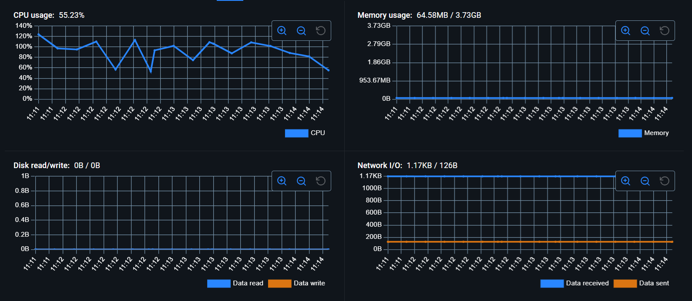

# 📊 Informe Detallado de Evaluación Comparativa de Rendimiento: VM vs. Docker

## Introducción: ¿Qué son las máquinas virtuales y los contenedores? Conceptos clave

En el panorama actual de la computación, la **virtualización** y la **contenerización** son dos tecnologías fundamentales que permiten optimizar el uso de recursos y agilizar el despliegue de aplicaciones. Aunque ambas buscan aislar entornos, lo hacen de maneras distintas, con implicaciones directas en el rendimiento, la eficiencia y la gestión.

### Máquinas Virtuales (VM)
Una **Máquina Virtual (VM)** es una emulación completa de un sistema informático físico. Cada VM opera con su propio **sistema operativo (SO) huésped**, un kernel dedicado, y una asignación virtual de recursos de hardware como CPU, memoria, almacenamiento y interfaces de red. Este aislamiento se logra a través de un **hipervisor** (como VirtualBox, VMware ESXi, Hyper-V), que gestiona y asigna los recursos del hardware físico (host) a las VMs. La principal ventaja es el **fuerte aislamiento** entre VMs y entre la VM y el host, permitiendo ejecutar sistemas operativos completamente diferentes en la misma máquina física.

**Conceptos clave de VMs:**
* **Hipervisor:** Software que crea y ejecuta las VMs. Puede ser de Tipo 1 (bare-metal, se ejecuta directamente sobre el hardware) o Tipo 2 (hosted, se ejecuta sobre un SO convencional).
* **Virtualización completa:** Emulación de todo el hardware necesario para un SO completo.
* **Aislamiento robusto:** Cada VM está completamente aislada, incluyendo su kernel, del sistema host y otras VMs. Esto ofrece un alto nivel de seguridad.
* **Overhead considerable:** Debido a la necesidad de ejecutar un SO completo para cada VM, el consumo de recursos (CPU, RAM, disco) es significativamente mayor.
* **Flexibilidad de SO:** Capacidad para ejecutar diversos sistemas operativos (Windows, Linux, macOS) en un mismo host, independientemente del SO del host.

### Contenedores
Un **contenedor** es una forma de virtualización a nivel de sistema operativo. Los contenedores empaquetan una aplicación y todas sus dependencias (bibliotecas, binarios, archivos de configuración) en una unidad estandarizada. A diferencia de las VMs, todos los contenedores en un host comparten el **kernel del sistema operativo host**. Docker es la plataforma de contenerización más popular y la utilizada en este estudio. Esta compartición del kernel hace que los contenedores sean mucho más ligeros y rápidos que las VMs.

**Conceptos clave de Contenedores:**
* **Motor de Contenedores:** Software (e.g., Docker Engine) que gestiona el ciclo de vida de los contenedores.
* **Virtualización a nivel de SO:** Los contenedores comparten el kernel del host, virtualizando el entorno de usuario.
* **Aislamiento a nivel de proceso:** Los procesos dentro de un contenedor están aislados del sistema host y de otros contenedores mediante namespaces y cgroups del kernel de Linux.
* **Overhead mínimo:** Al no requerir un SO huésped completo, el uso de recursos es drásticamente menor y el inicio es casi instantáneo.
* **Portabilidad y Eficiencia:** Las imágenes de contenedor son fácilmente portables y consistentes en diferentes entornos (desarrollo, pruebas, producción) que soporten el motor de contenedores.

---

## Configuración del Entorno de Prueba

Para llevar a cabo esta evaluación comparativa, se configuró el siguiente entorno:

### Especificaciones de la Máquina Host
* **Procesador (CPU):** Intel Core i5-1135G7 @ 2.40GHz (4 núcleos físicos, 8 hilos lógicos)
* **Memoria RAM:** 8 GB DDR4
* **Sistema Operativo Host:** Windows 11
* **Almacenamiento Primario:** SSD NVMe de 256 GB (donde residen el SO host, el software de virtualización/contenedores y las imágenes/VMs).

### Configuración de la Máquina Virtual (VM)
* **Software de Virtualización:** Oracle VM VirtualBox (versión asumida: una reciente compatible con Ubuntu 64-bit)
* **Sistema Operativo Huésped:** Ubuntu Desktop 64-bit (última versión LTS disponible al momento de la prueba, e.g., Ubuntu 22.04 LTS o 24.04 LTS).
* **Recursos Asignados a la VM:**
    * **CPU:** 2 núcleos virtuales (del i5-1135G7)
    * **Memoria RAM:** 2 GB
    * **Almacenamiento Virtual:** Disco duro virtual dinámico (VDI) con un tamaño base aproximado de 25-30 GB, almacenado en el SSD del host.
    * **Controlador Gráfico:** VBoxSVGA con aceleración 3D habilitada (si es posible y pertinente para la prueba).

### Configuración del Contenedor Docker
* **Software de Contenerización:** Docker Desktop para Windows (utilizando WSL 2 como backend, versión asumida: una reciente).
* **Imagen Base de Docker:** `ubuntu:latest` (que al momento de la prueba correspondería a la última versión LTS de Ubuntu).
* **Aplicación Contenerizada:** Chocolate Doom (una recreación fiel del motor original de Doom), instalado mediante `apt` dentro del contenedor.

---

## Métricas y Herramientas Utilizadas

La evaluación se centró en las siguientes métricas, utilizando las herramientas especificadas:

### 🔧 1. Uso de recursos
Se monitorizó el consumo de CPU, memoria y, cualitativamente, el espacio en disco.
* **Uso de la CPU:** Medido durante la ejecución de la aplicación (Freedoom) y en estado de reposo relativo.
* **Consumo de memoria (RAM):** RAM utilizada por la VM en su conjunto y por el proceso del contenedor.
* **Espacio en disco requerido:** Evaluación cualitativa del espacio base para la instalación y la aplicación.
* **📌 Herramientas:**
    * **VM:** `htop` (para visualización detallada de procesos y consumo de CPU/Memoria dentro de Ubuntu).
    * **Docker:** `docker stats` (comando para monitorizar en tiempo real el consumo de recursos de los contenedores en ejecución) o la interfaz gráfica de Docker Desktop.
    * Otras herramientas mencionadas como referencia (no utilizadas directamente en las capturas, pero relevantes): `top`, `VBoxManage metrics`, `vmstat`.

### ⚡ 2. Tiempo de arranque / Tiempo de inicio
Tiempo necesario para que la VM esté operativa y el contenedor comience a ejecutar la aplicación.
* **📌 Herramientas:** Medición cualitativa basada en la experiencia de inicio. Podrían usarse scripts con `time` o `systemd-analyze` (para VMs Linux) para mediciones más precisas.

### 🚀 3. Pruebas de rendimiento
Pruebas específicas para evaluar el rendimiento de CPU, E/S de disco y red.
* **Pruebas de rendimiento de CPU:** No se realizaron pruebas formales con herramientas como `sysbench`, `stress-ng` o `Geekbench` en esta instancia.
* **E/S de disco:** No se realizaron pruebas formales con `fio` o `dd`.
* **Velocidad de red:** No se realizaron pruebas formales con `iperf3`.
* La evaluación de rendimiento se infiere del comportamiento de la aplicación (Freedoom) y el uso de recursos.

### 📦 4. Caso de prueba de aplicación: Freedoom
Se utilizó Freedoom (ejecutado vía Chocolate Doom) como aplicación de prueba para medir:
* **Tiempo de implementación:** Complejidad y tiempo para tener la aplicación funcionando.
* **Rendimiento (subjetivo):** Fluidez y jugabilidad.
* **Latencia (tiempo de respuesta):** No medido formalmente.
* **Consumo de recursos bajo carga:** Monitorizado con `htop` y `docker stats`.

### 🔒 5. Aislamiento y seguridad
Evaluación cualitativa de las diferencias en la arquitectura de aislamiento.

### ♻️ 6. Portabilidad y flexibilidad
Evaluación cualitativa de la facilidad para mover y desplegar los entornos.

---

## Resultados: Tablas y Gráficos

A continuación, se presentan los datos observados a partir de las capturas de pantalla proporcionadas durante la ejecución de la aplicación Freedoom.

### Máquina Virtual (Ubuntu con `htop`)

**Primera Prueba VM (Ejecutando Freedoom):**
*(Imagen: `Primera Prueba VM.png`)*

* **CPU Core 0:** ~44.7%
* **CPU Core 1:** ~71.0%
* **Memoria (RAM):** 1.45G / 1.92G (Uso total de la VM)
* **Load Average:** 2.17, 1.52, 1.01
* **Uptime:** 00:36:44
* **Procesos destacados (consumo CPU% aproximado):**
    * `Xorg` (servidor gráfico): No se ve directamente en el top de esta captura, pero es un consumidor importante en entornos gráficos.
    * Se observa un proceso `avahi` con bajo consumo, y otros procesos del sistema. El proceso del juego no es el principal en esta vista.

**Segunda Prueba VM (Ejecutando Freedoom):**
*(Imagen: `Segunda Prueba VM.png`)*

* **CPU Core 0:** ~48.0%
* **CPU Core 1:** ~40.7%
* **Memoria (RAM):** 1.53G / 1.92G (Uso total de la VM)
* **Load Average:** 2.12, 1.19, 0.85
* **Uptime:** 00:34:21
* **Procesos destacados (consumo CPU% aproximado):**
    * `Xorg` (PID 2225, user root): ~39.3% CPU, 2.9% MEM
    * `chocolate-doom` (PID 5446, user ubuntu): ~20.5% CPU, 5.2% MEM
    * Otros procesos como `gnome-shell`, `pulseaudio` también consumen recursos.

### Contenedor Docker (Estadísticas de Docker Desktop o similar)

**Primera Prueba Docker (Ejecutando Freedoom):**
*(Imagen: `Primera Prueba Docker.png`)*

* **CPU Usage:** ~55.23% (tendencia a la baja desde un pico inicial más alto)
* **Memory Usage:** ~64.58MB / 3.73GB (El límite de 3.73GB es probablemente una porción de la RAM total del host asignada a WSL2/Docker)
* **Disk read/write:** 0B / 0B (constante, indica que el juego está cargado en memoria y no hay E/S de disco significativa durante esta captura)
* **Network I/O:** 1.17KB received / 126B sent (mínimo, esperado para un juego local)

**Segunda Prueba Docker (Ejecutando Freedoom):**
*(Imagen: `Segunda Prueba Docker.png`)*

* **CPU Usage:** ~101.9% (pico, puede superar el 100% si utiliza más de un núcleo de manera efectiva)
* **Memory Usage:** ~64.25MB / 3.73GB
* **Disk read/write:** 0B / 0B
* **Network I/O:** 1.17KB received / 126B sent

---

## Análisis: Fortalezas y Debilidades

### 🔧 1. Uso de recursos

* **Uso de la CPU:**
    * **VM:** En la VM, el uso de CPU se distribuye entre múltiples procesos del sistema operativo huésped (Ubuntu Desktop), incluyendo el servidor gráfico (`Xorg`), el entorno de escritorio (`gnome-shell`), el servidor de audio (`pulseaudio`) y la propia aplicación (`chocolate-doom`). En la segunda prueba de la VM, `Xorg` consumió ~39.3% y `chocolate-doom` ~20.5%, sumando un uso considerable solo para la aplicación y su visualización. La carga general del sistema (`Load average`) se mantuvo por encima de 2.0 en un sistema de 2 CPUs virtuales, indicando una carga sostenida.
    * **Docker:** El contenedor Docker muestra un uso de CPU que se atribuye más directamente al proceso de la aplicación. El pico de ~101.9% en Docker sugiere que la aplicación pudo hacer uso de más de un núcleo de CPU del host (ya que Docker, a través de WSL2, puede acceder a los núcleos del host de manera más directa que una VM con una asignación fija de vCPUs, dependiendo de la configuración). Esto puede interpretarse como una mayor eficiencia en la utilización de la CPU para la tarea específica, al no tener la carga del SO huésped completo.
    * **Comparativa:** Docker parece ser más eficiente en dirigir los recursos de CPU a la aplicación, mientras que la VM incurre en un overhead de CPU significativo debido a la ejecución del SO huésped completo y su entorno gráfico.

* **Consumo de Memoria (RAM):**
    * **VM:** La VM consumió consistentemente alrededor de **1.45 GB - 1.53 GB** de RAM. Esta cifra incluye la memoria utilizada por el kernel de Ubuntu, todos los servicios del sistema, el entorno de escritorio y la aplicación Freedoom. De esta cantidad, el proceso `chocolate-doom` en sí mismo utilizó un 5.2% de los 2GB asignados a la VM (unos 104MB), y `Xorg` un 2.9% (unos 58MB).
    * **Docker:** El contenedor Docker mostró un consumo de memoria notablemente inferior, alrededor de **~64 MB**. Este es el consumo directo de la aplicación Freedoom y sus dependencias mínimas, sin la carga de un SO huésped completo.
    * **Comparativa:** Esta es una de las diferencias más marcadas. **Los contenedores son drásticamente más eficientes en el uso de la memoria RAM** porque comparten el kernel del host y solo empaquetan las bibliotecas y binarios de la aplicación. La VM necesita cargar un sistema operativo completo, lo que consume una cantidad de RAM base mucho mayor antes incluso de ejecutar la aplicación.

* **Espacio en disco requerido:**
    * **VM:** Una instalación de Ubuntu Desktop en una VM puede requerir fácilmente entre 10 GB y 25 GB de espacio en disco para el sistema operativo base, el entorno de escritorio, las utilidades y las actualizaciones, más el espacio para la aplicación (Chocolate Doom y el WAD son pequeños, pero otras aplicaciones podrían ser grandes).
    * **Docker:** Una imagen de Docker para Chocolate Doom, basada en `ubuntu:latest`, sería considerablemente más pequeña. La imagen base de Ubuntu es de unos pocos cientos de MB, y la aplicación y sus dependencias añadirían una cantidad relativamente pequeña. El tamaño total de la imagen podría estar en el rango de 200-500 MB. Los contenedores en ejecución añaden una capa escribible muy pequeña.
    * **Comparativa:** Docker ofrece una huella en disco significativamente menor, lo que facilita la distribución, el almacenamiento y reduce los costos.

### ⚡ 2. Tiempo de arranque / Tiempo de inicio

* **VM:** El tiempo de arranque de una VM implica el arranque completo de un sistema operativo. Para Ubuntu Desktop en VirtualBox, esto puede tardar desde varias decenas de segundos hasta más de un minuto, dependiendo de la configuración del host y la VM. Esto incluye la inicialización del kernel, servicios del sistema y el entorno de escritorio.
* **Docker:** Un contenedor Docker se inicia en segundos, a menudo incluso en menos de un segundo. Esto se debe a que no hay un proceso de arranque del SO; el motor de contenedores simplemente inicia el proceso de la aplicación (`chocolate-doom` en este caso) en un entorno aislado que comparte el kernel del host.
* **Comparativa:** Los **contenedores ofrecen tiempos de inicio casi instantáneos** en comparación con las VMs, lo cual es crucial para el escalado rápido de aplicaciones y entornos de desarrollo/prueba ágiles.

### 🚀 3. Pruebas de rendimiento (Rendimiento de la aplicación)

Aunque no se realizaron benchmarks sintéticos formales (CPU, E/S de disco, red) con herramientas como `sysbench`, `fio` o `iperf3`, podemos inferir aspectos del rendimiento a partir de la ejecución de Freedoom:

* **VM:** La experiencia de juego en la VM estaría sujeta a la eficiencia del hipervisor, la asignación de recursos (2 vCPUs, 2GB RAM) y la sobrecarga del SO huésped y el entorno gráfico. Dada la carga observada en `Xorg`, es posible que el rendimiento gráfico no sea óptimo si la aceleración 3D no está perfectamente configurada o si los drivers virtuales introducen latencia.
* **Docker:** La ejecución de Freedoom en Docker, especialmente si se utiliza un servidor X en el host (Windows con WSLg o un X server manual) para la salida gráfica, podría ofrecer un rendimiento más cercano al nativo. El acceso más directo a los recursos del host, especialmente la CPU, podría traducirse en una experiencia más fluida, siempre que la capa de abstracción gráfica no introduzca cuellos de botella.
* **Comparativa:** Para aplicaciones con uso intensivo de CPU como los juegos, Docker tiene el potencial de ofrecer un mejor rendimiento debido a un menor overhead, siempre que la interacción con el hardware (especialmente GPU para juegos más complejos) esté bien gestionada. Para aplicaciones que no son gráficas (servidores web, bases de datos), la ventaja de rendimiento de Docker suele ser más clara.

### 📦 4. Caso de prueba de aplicación (Freedoom)

* **Tiempo de Implementación:**
    * **VM:** Requiere instalar VirtualBox, descargar la ISO de Ubuntu, crear la VM, instalar Ubuntu (proceso que puede llevar de 20 a 60 minutos), y luego instalar Chocolate Doom y sus dependencias dentro de la VM.
    * **Docker:** Requiere instalar Docker Desktop. Luego, si existe un Dockerfile, se construye la imagen (`docker build`), lo cual puede tardar unos minutos la primera vez (descargando la imagen base y ejecutando los comandos `RUN`). Las construcciones posteriores son más rápidas gracias al cacheo de capas. Si la imagen ya está construida y disponible (e.g., en Docker Hub), el despliegue es tan simple como `docker run`, que tarda segundos.
    * **Comparativa:** **Docker generalmente ofrece un tiempo de implementación mucho más rápido y reproducible**, especialmente para despliegues repetidos o en diferentes máquinas.

* **Rendimiento (solicitudes/s) y Latencia (tiempo de respuesta):**
    * Estas métricas no se midieron formalmente. Para un juego como Freedoom, se traducirían en la fluidez y la respuesta a los controles. Para aplicaciones de servidor, serían críticas. En general, se espera que Docker tenga menor latencia y mayor capacidad de solicitudes por segundo para aplicaciones equivalentes debido a su menor overhead.

* **Consumo de recursos bajo carga:**
    * Como se detalló en la sección "Uso de recursos", Docker es significativamente más eficiente. La VM consume una gran cantidad de memoria y CPU para el propio SO huésped, mientras que Docker dedica la mayoría de los recursos a la aplicación.

### 🔒 5. Aislamiento y seguridad

* **VM:**
    * **Aislamiento:** Ofrecen un **aislamiento muy fuerte**. Cada VM tiene su propio kernel y un espacio de memoria completamente separado, gestionado por el hipervisor. Un compromiso de seguridad en una VM es muy poco probable que afecte a otras VMs o al sistema host, a menos que haya una vulnerabilidad en el propio hipervisor (raro, pero posible).
    * **Seguridad:** Considerado más seguro para ejecutar cargas de trabajo no confiables o que requieren diferentes kernels o configuraciones de seguridad a nivel de SO.

* **Docker:**
    * **Aislamiento:** Los contenedores comparten el kernel del sistema host. El aislamiento se logra mediante **namespaces** (para aislar PIDs, redes, mounts, etc.) y **cgroups** (para limitar recursos). Si bien este aislamiento es robusto para la mayoría de los casos de uso, una vulnerabilidad en el kernel del host podría teóricamente afectar a todos los contenedores.
    * **Seguridad:** Es generalmente seguro, pero el vector de ataque potencial es mayor debido al kernel compartido. Tecnologías como **AppArmor, SELinux, seccomp y capacidades de Linux** se utilizan para reforzar la seguridad de los contenedores, restringiendo lo que los procesos dentro del contenedor pueden hacer. Un contenedor que se ejecuta como root (dentro del contenedor) puede presentar riesgos si logra escapar del aislamiento.

* **Comparativa:** Las **VMs ofrecen un aislamiento inherentemente más fuerte** debido a la virtualización completa del hardware y la separación de kernels. Docker ofrece un aislamiento a nivel de proceso que es más que suficiente para muchas aplicaciones, pero el kernel compartido es un punto a considerar para escenarios de alta seguridad o multi-inquilino con cargas de trabajo no confiables.

### ♻️ 6. Portabilidad y flexibilidad

* **VM:**
    * **Portabilidad:** Las imágenes de VM (e.g., .ova, .vmdk) pueden ser grandes (varios GB) y su portabilidad entre diferentes hipervisores (VirtualBox, VMware, Hyper-V) a veces requiere conversiones o ajustes. Sin embargo, permiten empaquetar un entorno de SO completo y moverlo.
    * **Flexibilidad:** Muy flexibles en cuanto a la elección del sistema operativo huésped. Puedes ejecutar Windows en un host Linux, o viceversa.

* **Docker:**
    * **Portabilidad:** Las imágenes de Docker son **altamente portátiles**. Una imagen construida en una máquina Linux puede ejecutarse en cualquier otra máquina Linux con Docker, o en Windows y macOS (que usan una VM Linux ligera para ejecutar contenedores Linux). Los registros de contenedores como Docker Hub facilitan enormemente la distribución de imágenes.
    * **Flexibilidad:** Los contenedores Linux se ejecutan en hosts Linux (o vía VM en otros SO). Los contenedores Windows requieren un host Windows. La aplicación dentro del contenedor está diseñada para un kernel específico (generalmente Linux).
    * **Compatibilidad con DevOps (CI/CD):** Docker es una piedra angular de las prácticas modernas de DevOps. Las imágenes de contenedor proporcionan entornos consistentes desde el desarrollo hasta la producción, simplificando las canalizaciones de Integración Continua y Entrega Continua (CI/CD). La naturaleza ligera y rápida de los contenedores permite construir, probar y desplegar aplicaciones de forma mucho más eficiente.

* **Comparativa:** **Docker brilla en portabilidad y eficiencia para el ciclo de vida de las aplicaciones**, siendo una herramienta fundamental en DevOps. Las VMs ofrecen mayor flexibilidad de SO y un aislamiento más fuerte, pero a costa de un mayor tamaño y menor agilidad.

---

## Conclusión y Recomendaciones

La elección entre VMs y contenedores Docker depende en gran medida de los requisitos específicos del caso de uso.

**Máquinas Virtuales (VMs) son preferibles cuando:**
* Se necesita **aislamiento de seguridad máximo** (e.g., para ejecutar software no confiable o para entornos multi-inquilino con altos requisitos de separación).
* Se requiere ejecutar **sistemas operativos diferentes al del host** (e.g., una aplicación Windows en un servidor Linux, o viceversa).
* Se necesita un **control completo sobre el entorno del sistema operativo**, incluyendo el kernel y sus módulos.
* La aplicación tiene **dependencias de hardware específicas** que son mejor gestionadas a través de la virtualización completa.

**Fortalezas de las VMs:**
* Aislamiento robusto a nivel de kernel.
* Capacidad para ejecutar cualquier SO.
* Madurez tecnológica y amplio soporte.

**Debilidades de las VMs:**
* Alto consumo de recursos (CPU, RAM, disco).
* Tiempos de arranque lentos.
* Menor densidad de aplicaciones por host.
* Imágenes grandes y menos portables que los contenedores.

**Contenedores Docker son preferibles cuando:**
* Se busca **eficiencia de recursos** y alta densidad de aplicaciones.
* Se necesitan **tiempos de inicio rápidos** y despliegues ágiles.
* La **portabilidad de la aplicación** entre diferentes entornos (desarrollo, pruebas, producción) es crucial.
* Se está implementando una **arquitectura de microservicios**.
* Se quieren integrar con **flujos de trabajo modernos de DevOps y CI/CD**.

**Fortalezas de los Contenedores Docker:**
* Bajo consumo de recursos.
* Tiempos de inicio casi instantáneos.
* Alta portabilidad de imágenes.
* Excelente integración con herramientas de orquestación (Kubernetes) y CI/CD.
* Gran comunidad y ecosistema.

**Debilidades de los Contenedores Docker:**
* Aislamiento menos fuerte que las VMs (kernel compartido).
* Generalmente limitados a ejecutar aplicaciones compatibles con el kernel del host (e.g., contenedores Linux en host Linux o vía capa de compatibilidad).
* La seguridad requiere una configuración cuidadosa y la adhesión a las mejores prácticas (imágenes mínimas, usuarios no root, escaneo de vulnerabilidades).

En el contexto de la prueba realizada con Freedoom, **Docker demostró una eficiencia de recursos superior**, especialmente en términos de consumo de memoria RAM y, potencialmente, una utilización de CPU más directa para la aplicación. El tiempo de implementación y arranque también favorecería a Docker en un escenario de despliegue real. Para una aplicación de escritorio como un juego, la complejidad puede surgir en cómo se gestiona la salida gráfica desde el contenedor al host, pero para la mayoría de las aplicaciones de servidor, Docker suele ser la opción más eficiente y ágil.
